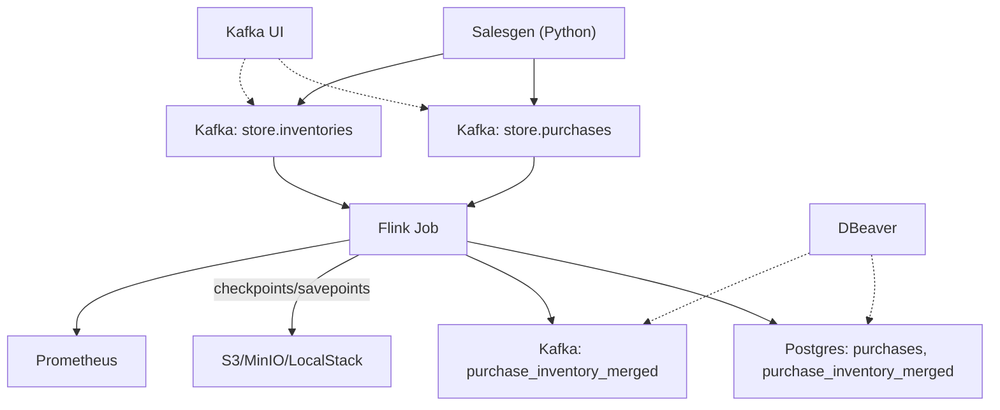
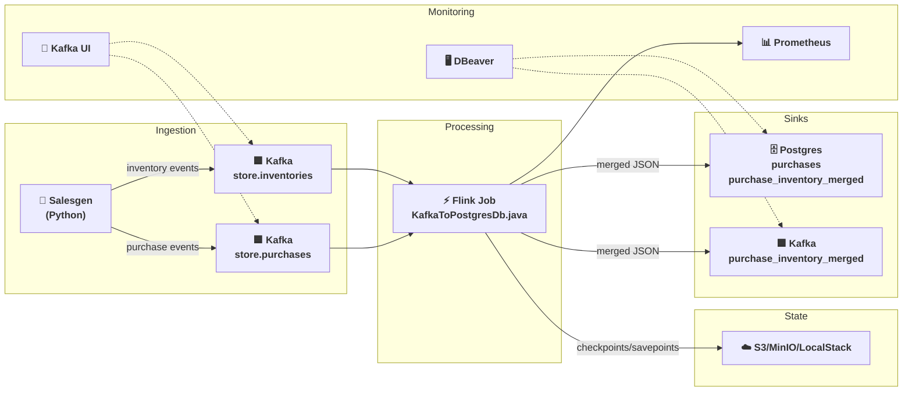
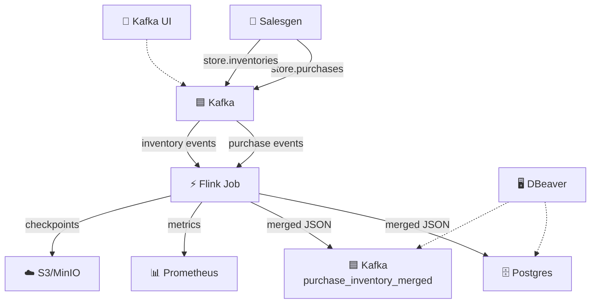

# Flink on Kubernetes: End-to-End Streaming Stack

Deploy and manage Apache Flink jobs on Kubernetes with a modern, production-ready stack.

## Features
- **Flink streaming jobs** (Java, Maven)
- **Kafka** for event ingestion
- **PostgreSQL** for sinks
- **Helm** and **Kubernetes** manifests for deployment
- **Docker Compose** for local development
- **CI/CD** pipeline for build, test, and deploy

---

## Table of Contents
- [Overview & Architecture](#overview--architecture)
- [Repository Structure](#repository-structure)
- [Quick Start](#quick-start)
- [Development & Packaging](#development--packaging)
- [Kubernetes Deployment](#kubernetes-deployment)
- [Scaling, Upgrades, Savepoints](#scaling-upgrades-savepoints)
- [Monitoring & Observability](#monitoring--observability)
- [CI/CD Pipeline](#cicd-pipeline)
- [Best Practices](#best-practices)
- [References](#references)

---

## Overview & Architecture

This project demonstrates a full streaming data pipeline:
- **Flink job**: Reads purchase events from Kafka, writes to PostgreSQL and Kafka (purchase_inventory_merged)
- **Kafka**: Event broker for streaming data
- **Postgres**: Sink for processed events
- **Kafka (purchase_inventory_merged)**: Sink for merged/processed events
- **salesgen**: Synthetic event generator for Kafka
- **LocalStack/MinIO**: S3-compatible storage for state backend (optional)
- **Helm/K8s**: Production deployment
- **Docker Compose**: Local dev stack

```mermaid
graph TD;
  salesgen[Salesgen (Python)] --> kafka[Kafka: store.purchases, store.inventories];
  kafka --> flink[Flink Job];
  flink --> postgres[Postgres: purchases, purchase_inventory_merged];
  flink --> mergedKafka[Kafka: purchase_inventory_merged];
  flink -- checkpoints/savepoints --> s3[(S3/MinIO/LocalStack)];
  flink --> prometheus[(Prometheus)];
  kafka-ui-.->kafka;
  dbeaver-.->postgres;
  dbeaver-.->mergedKafka;
```

This diagram shows how the Flink job writes merged data to both Postgres and Kafka, enabling analytics and monitoring from both sinks.

---

## Repository Structure

| Path | Description |
|------|-------------|
| `flink-jobs/purchase-report/` | Main Flink job (Java, Maven) |
| `docker/` | Docker Compose, Dockerfiles |
| `salesgen/` | Synthetic event generator (Python) |
| `pgsql/` | Postgres init scripts |
| `helm/flink/` | Helm chart for Flink deployment |
| `k8s/` | K8s manifests: CRDs, RBAC, PVC, monitoring |
| `ci-cd/` | CI/CD pipeline (GitHub Actions) |
| `scripts/` | Automation scripts (build, deploy, scale, upgrade, etc.) |
| `docs/` | Architecture, deployment, ops docs |

---


## Quick Start

### Prerequisites
- Docker & Docker Compose
- Java 11+
- Maven
- Python 3 (for salesgen)
- kind (for local K8s)
- kubectl, helm

### Local Dev Stack

```sh
make -f Makefile.docker all
# or manually:
cd flink-jobs/purchase-report && mvn clean package
docker build -f docker/Dockerfile -t purchase-report-job:latest .
docker-compose -f docker/docker-compose.yml up
```

Access:
- Flink UI: http://localhost:8081
- Kafka UI: http://localhost:8082
- Postgres: localhost:5432 (user/pass: postgres)

---


## Development & Packaging

- Edit Flink job: `flink-jobs/purchase-report/src/main/java/com/example/flink/KafkaToPostgresDb.java`
- Build JAR: `make build-jar` or `mvn clean package`
- Build Docker image: `make build-docker` or `docker build ...`
- Run stack: `make -f Makefile.docker up`
- Generate events: salesgen auto-starts, or run manually

---


**Flink Job:**
- Java 11+, Flink 1.20, Kafka connector, JDBC connector
- See `pom.xml` for dependencies

**Build steps:**
```sh
cd flink-jobs/purchase-report
mvn clean package
cd ../..
docker build -f docker/Dockerfile -t purchase-report-job:latest .
```

---


## Kubernetes Deployment

### 1. Prepare Cluster
- Start kind: `./scripts/start-kind.sh`
- Install Flink K8s Operator: `./scripts/prepare-dev-env.sh`

### 2. Build & Load Image
```sh
./scripts/build-jar.sh
./scripts/build-docker.sh
./scripts/load-image-to-kind.sh purchase-report-job:latest
```

### 3. Deploy Resources
```sh
kubectl apply -f k8s/flink-resources.yaml
kubectl apply -f k8s/flink-deployments/flink-application.yaml
```

### 4. Monitor
```sh
kubectl get pods -n flink
kubectl port-forward svc/purchase-report-app-rest -n flink 8081:8081
# Access Flink UI at http://localhost:8081
```

---


## Scaling, Upgrades, Savepoints

- Scale TaskManagers: `./scripts/scale-taskmanagers.sh <replicas>`
- Trigger savepoint: `./scripts/trigger-savepoint.sh <job_id>`
- Upgrade job: `./scripts/upgrade-job.sh`
- Parallelism: edit K8s manifest or patch CRD

---


## Monitoring & Observability

- Prometheus ServiceMonitor: `k8s/monitoring/servicemonitor.yaml`
- Flink metrics exported on port 9249
- View logs: `make -f Makefile.docker logs` or `kubectl logs`

---


## CI/CD Pipeline

- GitHub Actions: `ci-cd/pipeline.yaml`
  - Build JAR with Maven
  - Build & push Docker image
  - Deploy to K8s with Helm

---


## Best Practices

- Use RocksDB for large state
- Enable incremental checkpoints
- Use exactly-once semantics
- Monitor backpressure and metrics
- Retain savepoints for rollback
- Test recovery and upgrade flows

---


---

## References

- [Flink Documentation](https://nightlies.apache.org/flink/)
- [Flink Kubernetes Operator](https://nightlies.apache.org/flink/flink-kubernetes-operator-docs-main/)
- [Helm](https://helm.sh/docs/)
- [Kubernetes](https://kubernetes.io/docs/)

---

## License

Apache License 2.0

---

## Postgres Data Analysis with DBeaver

For advanced data analysis and monitoring, you can use [DBeaver](https://dbeaver.io/) (or any SQL client) to connect to the running Postgres instance:

- **Host:** localhost
- **Port:** 5432
- **Database:** purchase_db
- **User:** postgres
- **Password:** postgres

DBeaver provides a graphical interface for:
- Inspecting and querying tables (e.g., purchases, purchase_inventory_merged)
- Visualizing data and running analytics
- Monitoring schema changes and table growth
- Exporting results for reporting

> Tip: You can use DBeaver's ER diagrams, data export, and SQL editor for deeper insights into your streaming pipeline results.

---

## Dual-Sink Streaming Architecture (GitHub Compatible)



This diagram is fully compatible with GitHub's Mermaid renderer and accurately shows the dual-sink streaming architecture.

---

## Detailed Data Flow: Dual-Sink Streaming Pipeline

<div align="center">



</div>

**Legend:**
- <b>🟦 Blue nodes</b>: Kafka topics (source/sink)
- <b>🗄️ Gray nodes</b>: Postgres sinks
- <b>⚡ Flink Job</b>: Stream processing
- <b>🛒 Salesgen</b>: Event generator
- <b>☁️ S3/MinIO/LocalStack</b>: State backend
- <b>📊 Prometheus</b>: Metrics/monitoring
- <b>🔎 Kafka UI</b>: Kafka topic browser
- <b>🖥️ DBeaver</b>: Data analysis
- <b>Dashed arrows</b>: Monitoring/analytics access
- <b>Solid arrows</b>: Main data flow

---

## Component Interaction Overview



---

## Database & Table Initialization

Postgres tables and users are initialized automatically when the container starts, using the unified DDL script at `pgsql/init.sql`. No manual table creation is required.

## Automation & Makefile Usage

The `Makefile.docker` automates build, startup, database initialization, and job submission:

```sh
make -f Makefile.docker all
# Builds, starts stack, initializes DB, submits Flink job
```

Other useful targets:
- `make -f Makefile.docker logs` — View logs
- `make -f Makefile.docker check-purchases` — Check sample records in purchases table
- `make -f Makefile.docker create-joined-table` — (No-op, handled by init.sql)

## Troubleshooting

- If job submission fails, check logs with `make -f Makefile.docker logs`.
- Ensure Postgres is healthy and tables exist (see `pgsql/init.sql`).
- For database errors, restart the stack to re-initialize tables.
- For dependency issues, rebuild with `make -f Makefile.docker build`.
---
---
